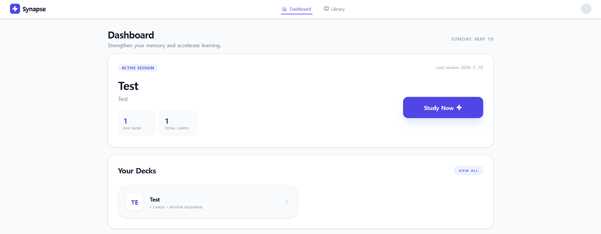

# Synapse 

Synapse is a high-performance, aesthetically pleasing spaced-repetition learning platform. Designed for students and lifelong learners who want a distraction-free environment to master complex topics efficiently.




## Features

- **Dynamic Library**: Organize your study materials into custom decks with ease.
- **Mastery Study Mode**: Intelligent spaced-repetition interface with fluid animations.
- **Bulk Creation**: Import dozens of cards at once using the bulk paste feature.
- **Responsive Design**: Study on any device with a UI optimized for both speed and clarity.
- **SQLite Powered**: Fast, local data persistence for your decks and cards.

## Tech Stack

- **Frontend**: React 18, Vite, Tailwind CSS
- **Animations**: Framer Motion
- **Icons**: Lucide React
- **Backend**: Node.js (Express)
- **Database**: SQLite (better-sqlite3)

## Getting Started

### Prerequisites

- Node.js (v18 or higher)
- npm or yarn

### Installation

1. Clone the repository:
   ```bash
   git clone https://github.com/your-username/synapse.git
   ```

2. Install dependencies:
   ```bash
   npm install
   ```

3. Start the development server:
   ```bash
   npm run dev
   ```

4. Open your browser and navigate to `http://localhost:3000`

## How to Use

1. **Create a Deck**: Go to the Library and click "New Deck". You can add initial cards right there.
2. **Add Cards**: Use the "Add Card" button on any deck to add cards individually or use "Bulk Paste" for high-volume entry.
3. **Study**: Click the Play button on any deck. Flip cards to reveal answers and rate your memory (Hard, Good, Easy) to schedule the next review.
